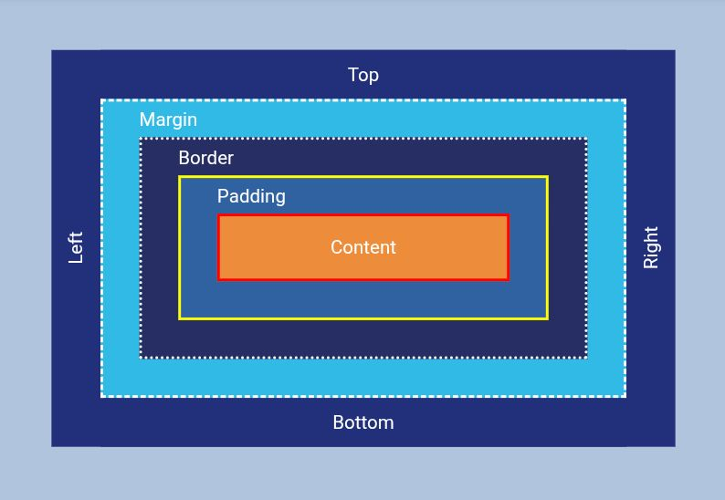

# 📦 Box Model Playground

A visual and interactive playground that demonstrates the **CSS Box Model** concept using HTML and CSS.  
This project aims to help beginners clearly understand how content, padding, border, and margin interact in the layout of elements.



---

## 🚀 Technologies Used

- HTML5
- CSS3 (Flexbox, Custom Properties, Writing Modes)

---

## 🎯 What I Learned

- 📦 The full structure of the **Box Model** (`margin` → `border` → `padding` → `content`).
- 🎨 How to visually represent each layer using CSS properties like `background-color`, `border`, `outline`.
- 💡 How to write **vertical text** using:
  ```css
  writing-mode: vertical-rl;
  transform: rotate(180deg);

This helped me create labels like Left, Right, Top, and Bottom to clarify the sides of the box.

📐 The effect of box-sizing: border-box and how it impacts width/height calculations.

📱 Basics of responsive design using flexbox and relative units (vw, vh).

---

✅ Features

Interactive visualization of the box model layers.

Custom labels for each direction (Top, Right, Bottom, Left).

Responsive layout for different screen sizes.

Clear color coding to distinguish box model sections.

---

📝 To Do (Enhancements)

[ ] Add :hover effects to highlight each layer with subtle animations.

[ ] Add tooltips or floating info boxes with descriptions for margin, border, etc.

[ ] Allow switching between border-box and content-box modes to compare behavior.

[ ] Add a color legend / key at the bottom of the page for better UX.

[ ] Improve accessibility: add aria-labels and keyboard support.

[ ] Write a detailed blog-style article or tutorial based on this playground.

---

🧪 How to Use

1. Clone the repository:

git clone https://github.com/your-username/box-model-playground.git


2. Open index.html in your browser.


3. Explore how the different layers of the box model are structured.

---

📌 Author

Created with ❤️ by JaLalSaa

---

📚 License

This project is licensed under the MIT License.
