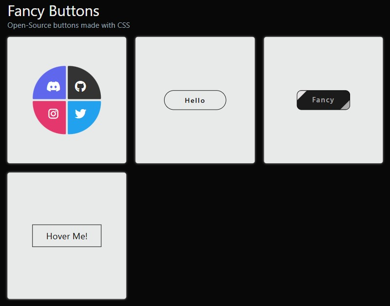

# 🎨 Fancy CSS Buttons Collection

A set of **interactive and stylish buttons** built using **pure HTML & CSS**.  
This project showcases multiple hover animation techniques, from subtle color transitions to complex background fills — perfect for learning and experimenting with modern button styles.



---

## 🚀 Technologies Used

* HTML5
* CSS3 (Flexbox, Transitions, Pseudo-elements)
* Font Awesome (for icons)

---

## 🎯 What I Learned

* 🖱 How to create **hover animations** using `::before` and `::after` pseudo-elements.
* 🎨 Styling buttons with **gradients, shadows, and rounded corners** for unique effects.
* 📦 Using **Flexbox** to center and arrange button layouts responsively.
* 🎭 Layering elements and controlling **z-index** for animation effects.
* ⚡ Smooth color and shape transitions with `transition` and `transform`.
* 📱 Creating responsive button layouts with `grid` and media queries.

---

✅ Features

* Four distinct button styles:
  1. **Social Media Buttons** — colored corner designs for Discord, GitHub, Twitter, Instagram.
  2. **Expanding Circle Button** — background grows on hover.
  3. **Striped Fancy Button** — animated diagonal stripe effect.
  4. **Hover Fill Button** — background color fills from left to right.
* Fully responsive grid layout.
* Pure HTML & CSS — no JavaScript required.


---

📝 To Do (Enhancements)

* [ ] Add more button styles with gradient animations.
* [ ] Include dark mode / light mode switch.
* [ ] Include tooltip descriptions for each button style.

---

## 🧪 How to Use

1. Clone this repository:
   ```bash
   git clone https://github.com/JaLalSaa/css15x15-challenge.git
   ```
2. Navigate to the folder:
   ```bash
   cd css15x15-challenge/02-buttons
   ```
3. Open `index.html` in your browser.

---

📌 Author

Created with ❤️ by JaLalSaa

---

## 📄 License

This project is licensed under the **MIT License** — feel free to use and modify for personal or commercial purposes.
