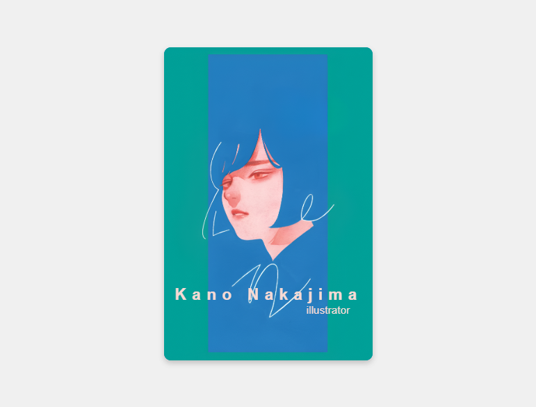
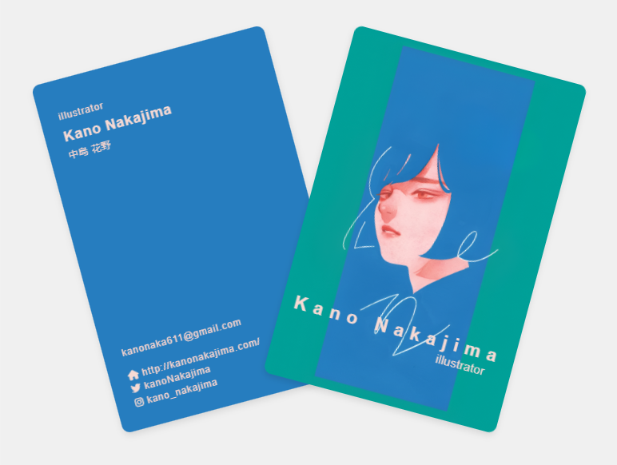

# 💳 CSS Two-Card Reveal Animation

A **stylish interactive card animation** built using **pure HTML & CSS**.  
This project features two stacked cards — the front card rotates and slides away to reveal the back card containing personal or contact information.  
Perfect for learning about transforms, transitions, responsive design, and creative hover effects.

<p float="left">
  
  
</p>

---

## 🚀 Technologies Used

* HTML5
* CSS3 (Flexbox, Transforms, Transitions, Pseudo-elements)
* Font Awesome (for icons)

---

## 🎯 What I Learned

* 🎯 How to use **`transform-origin`** to pivot animations from the bottom edge.
* 🌀 Combining multiple transforms like `rotate` and `translate` for smooth motion.
* 🎭 Stacking and layering elements using **absolute positioning** and `z-index`.
* 📦 Using **Flexbox** to perfectly center elements in the viewport.
* 🖌 Creating styled backgrounds with images, shadows, and rounded corners.
* ⚡ Adding smooth hover animations with `transition` and easing.
* 🖱 Enhancing visuals with **Font Awesome** icons.
* 📱 Making the cards **responsive** using `clamp()`, media queries, and percentage-based sizing.

---

✅ Features

* **Two-layer stacked card design** — one image card (front) and one information card (back).
* **Hover animation**:
  1. Front card rotates and slides to the right.
  2. Back card rotates and slides to the left.
* Natural **bottom-center rotation origin**.
* Integrated **contact section** with icons.
* Fully **responsive layout**: scales correctly on tablets and mobile screens.
* Clean, minimal design using only HTML & CSS.

---

📝 To Do (Enhancements)

* [ ] Add **flip animation on click/tap** for mobile devices.
* [ ] Include **dark/light mode** variants.
* [ ] Add additional **card designs and color themes**.

---

## 🧪 How to Use

1. Clone this repository:
   ```bash
   git clone https://github.com/JaLalSaa/css15x15-challenge.git
````

2. Navigate to the folder:

   ```bash
   cd css15x15-challenge/XX-card-animation
   ```
3. Open `index.html` in your browser.

---

📌 Author

Created with ❤️ by **JaLalSaa**

---

## 📄 License

This project is licensed under the **MIT License** — feel free to use and modify for personal or commercial purposes.

```

